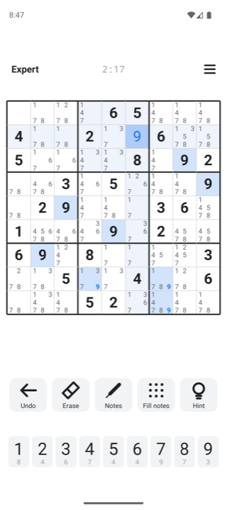

# Bare Sudoku

Ad-free, tiny Sudoku for Android and iOS. Zero libraries, no permissions, no tracking, no internet.

Play in the browser at [baresudoku.com](https://baresudoku.com) (separate project: [baresudoku-web](https://github.com/alparslandev/baresudoku-web)), or download the [latest Android APK](https://github.com/alparslandev/baresudoku/releases/latest/download/baresudoku.apk).



## Features

- Four levels (Easy, Medium, Hard, Expert). Every puzzle is solvable by pure logic, no guessing.
- Notes, undo, erase, fill all notes (tap again to clear them), restart the same puzzle, and hints that explain the reasoning: singles, locked candidates, pairs and triples, X-Wing, Y-Wing, Swordfish, XYZ-Wing.
- Digit-first entry: tap a digit key twice (or once with nothing selected) to lock it, then tap cells to place it. Cell-first entry works as usual.
- Row, column, box and same-digit highlights, mistake marking (can be turned off), automatic save, dark mode, landscape layout.
- English and Turkish, following the system language.

## Android (`android/`)

Plain Java, no Gradle. APK about 25 KB, Android 8 and newer. Needs Android SDK build-tools 36.0.0, platform 36 and JDK 17.

```sh
android/build.sh   # android/build/baresudoku.apk, prints the size in bytes
android/test.sh    # generator, solver and game state tests on the desktop JVM
bun run deploy     # tests, version bump, APK, tag and GitHub release
```

The signing key lives in `~/.baresudoku`; back it up, updates are only possible with the same key.

## iOS (`ios/`)

The engine is C (`Sudoku.c`, `Game.c`), the interface is Objective-C drawn by hand (`main.m`). No storyboards, no Swift, no libraries. The signed App Store package is about 55 KB; installed, the app is about 150 KB, most of it the Mach-O page alignment and the icon catalog Apple requires. Needs Xcode 26.

```sh
ios/test.sh        # the same engine and game state checks, compiled with clang
ios/build.sh sim   # quick simulator build: ios/build/sim/BareSudoku.app
open ios/BareSudoku.xcodeproj
bun run ipa        # archive and export a signed App Store IPA without uploading
bun run deploy:ios # tests, build number bump, archive, upload to App Store Connect, tag
```

The icon is generated from `ios/icon.svg` (the site favicon); `ios/store/` holds the App Store screenshots and listing text.

## License

MIT
